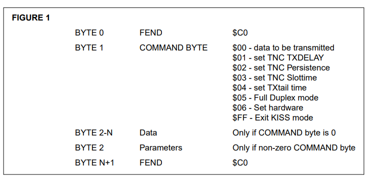
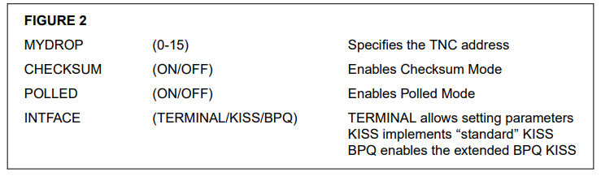
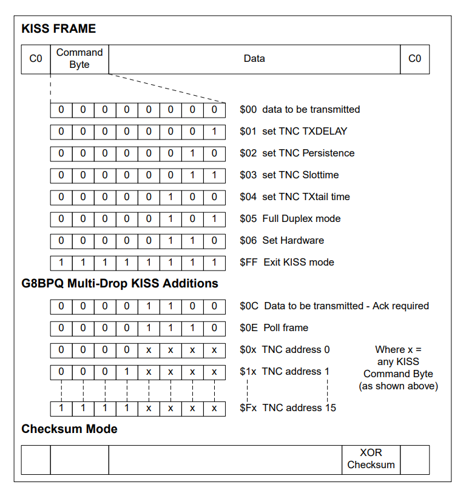

Multi-Drop KISS operation
by Kar l Medcalf WK5M
John Wiseman (G8BPQ) has developed a multi-drop KISS protocol, allowing several TNCs to be
connected to a single serial I/O port while operating KISS mode.
To prevent all TNCs from responding to all data from the serial I/O port (called the master), each
TNC must have a specific address. This address is contained in the high nibble of the command
byte in each KISS frame.
The KISS for mat is shown in Figure 1.
For multi-drop KISS, the Command byte is modified by changing the first digit of the HEX value
listed in Figure 1. As listed, the TNC with address 0 would be addressed. For TNC address 1 the
command byte would be:
$10 Data to be transmitted
$11 Set TNC TXDELAY
$12 Set TNC Persistence
$13 Set TNC Slottime
$14 Set TXtail
$15 Set Full Duplex mode
$16 Set Hardware
$FF Exit KISS mode
Note that since the $FF code applies to all units,asingle $FF command byte would cause all
TNCs on the serial I/O port to leave KISS mode.
Within any given frame of data, the FEND character can only appear as the opening and closing
characters, thus delimiting the frame. If the $C0 value must be sent as data or as an argument to
a TNC command ($x1, $x2, or $x3 command byte), then standard KISS transparency must be
applied.
The G8BPQ multi-drop KISS has extended the KISS command bytes listed above by adding
some new values for the low-order nibble. These additions are:
$xC Data to be transmitted - required
$xE Poll frame (see Polled Mode below)

Figure 1

Acknowledgment Mode (ACKMODE)
The G8BPQ Acknowledgment Mode is intended mainly for HF operation where data that has
been sent to the TNC for transmission may not actually be transmitted for an extended period of
time. When this mode is selected, the master unit would send the special $xC command byte,
causing the selected TNC to return an acknowledgment when the frame has been sent. This
allows the master to start his timing parameters (FRACK, etc.) at the time the frame actually left
the TNC. For instance, if the master wants to send a data frame to TNC with address 5 and wants
to use the Acknowledgment Mode, the frame would begin with:
$C0 $5C $aa $bb data to be transmitted $C0
The $aa and $bb in the example are not transmitted, but are returned to the master by the TNC
when the frame is transmitted. This allows you to sequentially number the frames if you desire, as
these two bytes may be any value. When the TNC has transmitted this frame it will send the following back to the master:
$C0 $5C $aa $bb $C0
Polled Mode
The G8BPQ extended KISS code also allows a Polled Mode. In this mode, none of the TNCs will
send any data to the master until the master polls the specific TNC for data. The poll from the
master consists of the following:
$C0 $xE $C0 where x is the address of the unit
If the addressed TNC has data, that data is sent to the master (only one frame is send for each
poll, even if more are available). If the addressed TNC has no data, the Poll frame is returned to
the master ($C0 $xE $C0).

Checksum Mode
One final mode now implemented in the G8BPQ extended KISS protocol is a Checksum Mode. In
this mode, data sent between the master and the slave TNCs contains a checksum to insure that
the data did not get corrupted on the serial I/O line. The checksum is a simple exclusive OR of all
data between the opening and closing FEND characters. If this data contains any transparency
processed data, the REAL value is used and not the escaped characters. The checksum is a single byte, and is sent before the closing FEND. Checksum may be used in conjunction with any or
all of the above modes.
When several TNCs are connected to a common RS-232 serial I/O line, the data output from the
master (TXD on a computer or RXD on the Data Engine) and the ground will be directly connected to the TXD line and ground of all slave TNCs. The RXD line from each of the TNCs must
have a single diode connected with the ANODE to the slave TNC and the cathodes all tied
together. The cathode side is then connected to the master data input (RXD on a computer or
TXD on the Data Engine).
Since these modes are not directly compatible with ‘‘standard’’ KISS, the firmware must provide
some method of selecting the var ious modes of operation. The Kantronics implementation of the
extended KISS has added the commands shown in Figure 2 to select operation.
Note that to use the Acknowledgment Mode, you must have the INTFACE set to BPQ. The
acknowledgment will be sent automatically if the command byte is $xC.

Figure 2

John’s implementation of this extended KISS protocol should enhance KISS type operations,
especially on HF where timing becomes a particular problem. The ability to ‘‘multi-drop’’ many
TNCs from one master (computer or Data Engine) allows multi-por t networ king nodes from a single serial port on a computer, thus reducing hardware requirements.
The multi-drop (or extended KISS) EPROMS for Kantronics TNCs are available as part of the
G8BPQ Data Engine firmware which may be downloaded from the Kantronics BBS at (913)
842-4678. John is preparing multi-drop KISS images for other TNCs and will distribute them
along with his standard PC based G8BPQ code. When these other multi-drop KISS eproms
become available, they will be included in the Data Engine BPQ distribution.

